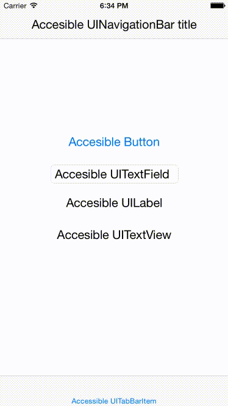

#TBRFontSizeAccessibility

[](https://travis-ci.org/techbrewers/TBRFontSizeAccessibility.svg?branch=master)

Easily make your UI change font size when accessibility text size is changed.



##Installation

* Add the `TBRFontSizeAccessibility` module to your project

##Example

```swift

import TBRFontSizeAccessibility

class NavigationController: UINavigationController {

  @IBOutlet weak var accesibleTabBarItem: UITabBarItem!
  
  override func viewDidLoad() {
    super.viewDidLoad()
    
    let defaultFont = UIFont.systemFontOfSize(12);
    accesibleTabBarItem.accessibilityFont(defaultFont)
  }
}

class ViewController: UIViewController {

  @IBOutlet weak var accesibleLabel: UILabel!
  @IBOutlet weak var accesibleTextView: UITextView!
  @IBOutlet weak var accesibleTextField: UITextField!
  @IBOutlet weak var accesibleButton: UIButton!

  override func viewDidLoad() {
    super.viewDidLoad()

    // Base font
    let defaultFont = UIFont.systemFontOfSize(20);

    accesibleLabel.accessibilityFont(defaultFont)
    accesibleTextView.accessibilityFont(defaultFont)
    accesibleTextField.accessibilityFont(defaultFont)
    accesibleButton.titleLabel?.accessibilityFont(defaultFont)
    navigationController?.navigationBar.accessibilityFont(defaultFont)
    
    // Use this block if you want your object to listen for accessibility changes on unsupported classes
    otherUnsupportedObject.accesibilityChangeObserver = AccessibilitySizeChangeObserver(fromObject:self, fromClosure:{ [unowned self] in
      otherUnsupportedObject.font = defaultFont.fontWithSize(defaultFont.pointSize + AccessibilityPointSize.offset())
    })
  }
}
```

## Supported classes

- `UILabel`
- `UIButton` (Uses `UILabel` internally)
- `UITextView`
- `UITextField`
- `UINavigationBar`
- `UITabBarItem`

##License

The MIT License (MIT)

Copyright (c) 2015 TechBrewers LTD.

Permission is hereby granted, free of charge, to any person obtaining a copy
of this software and associated documentation files (the "Software"), to deal
in the Software without restriction, including without limitation the rights
to use, copy, modify, merge, publish, distribute, sublicense, and/or sell
copies of the Software, and to permit persons to whom the Software is
furnished to do so, subject to the following conditions:

The above copyright notice and this permission notice shall be included in all
copies or substantial portions of the Software.

THE SOFTWARE IS PROVIDED "AS IS", WITHOUT WARRANTY OF ANY KIND, EXPRESS OR
IMPLIED, INCLUDING BUT NOT LIMITED TO THE WARRANTIES OF MERCHANTABILITY,
FITNESS FOR A PARTICULAR PURPOSE AND NONINFRINGEMENT. IN NO EVENT SHALL THE
AUTHORS OR COPYRIGHT HOLDERS BE LIABLE FOR ANY CLAIM, DAMAGES OR OTHER
LIABILITY, WHETHER IN AN ACTION OF CONTRACT, TORT OR OTHERWISE, ARISING FROM,
OUT OF OR IN CONNECTION WITH THE SOFTWARE OR THE USE OR OTHER DEALINGS IN THE
SOFTWARE.